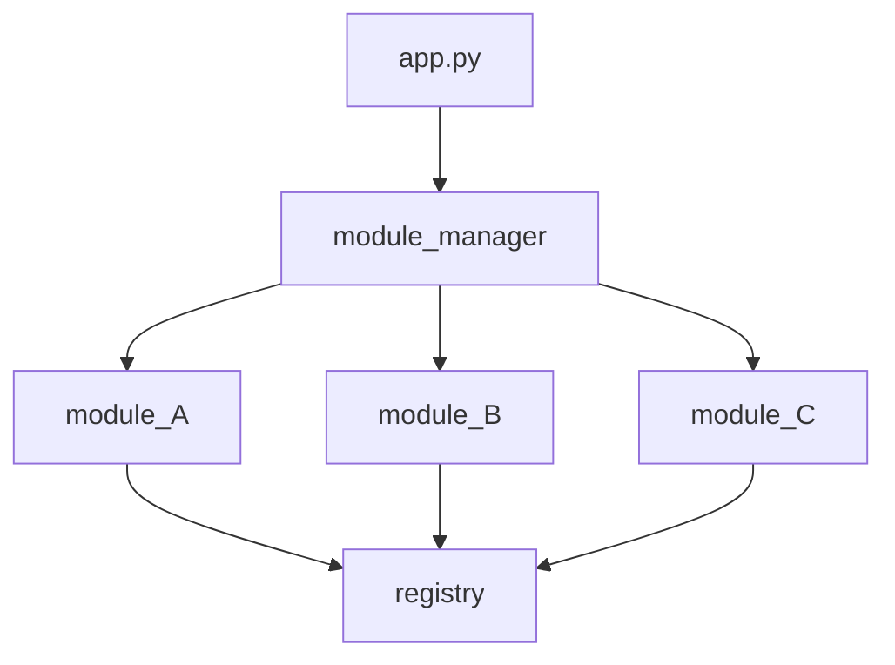

A simple, modular, yet powerful python module manager. Easily configurable. Get your new projects started with breeeze, without bloat.

# EZini Module Manager

This ```module_manager``` is pretty basic to use. It sits between the main application module(app.py, \_\_init\_\_.py,  etc) and the rest of the programs' modules. The ```registry``` component of this ```module_manager``` sits seemingly isolated at the end, however, it is in my opinion the most powerful feature of this extremely basic system.

If you read this doc file from top-down, you'll have the only understanding there is to have about this ```module_manager```.

To get a mental model before we start, it looks/works like this:




## Module Manager

>[!NOTE] The ```module_manager``` is initialized by your main application ( app.py, \_\_init\_\_.py, etc ). Basically wherever your apps main entry point is. 

If you want a function from a module, that module's name goes here.  

Let's say I have 3 modules I want to import functions from: module_A.py, module_B.py, and module_C.py 

There are 2 syntatic ways to gain access to the ```module_manager```

```python
# app.py

from module_manager import module_import
...

...
modlist = ['module_A', 'module_B', 'module_C']
module_import(modlist)
``` 
 

You might notice how these module names align with the diagram above. That's because that's exctly what's happening here. 


## Registry (registry.py)

Text here


## Additional Modules

// any additional modules to add to the registry

I

When initializing any additional modules' functions, only
a couple of steps are required.

First, we need to import the registry's functions:

```python
import registry
``` 
or
```python
from registry import register_func, call_func
```

