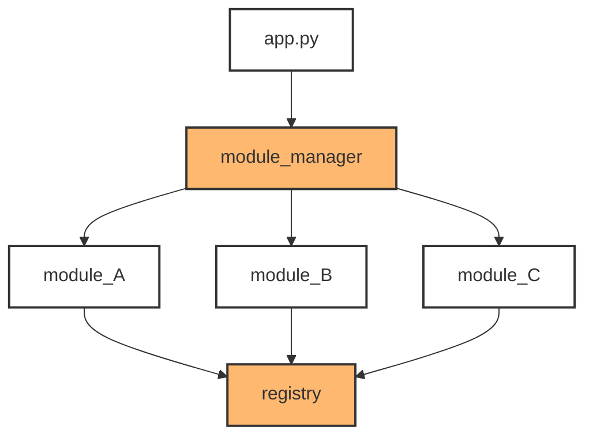

# EZ<sub>ini</sub> Module Manager
An **_event-driven_** way to decouple your imports and function calls.  

Simple, modular, powerful, and easily configurable.  

Truly Plug-n-Play.

This is one of those documents you can finish reading with your coffee and understand everything about it.

This ```module_manager``` is pretty basic to use. It sits between the main application module( main.py, app.py, etc ) and the rest of the programs' modules. The ```registry``` component of this ```module_manager``` sits seemingly isolated at the end, however, it is in my opinion the most powerful feature of this extremely basic system. This system is as bare bones as it gets; zero bloat. No additional imports are needed other than the basic imports explained in this documentation. Other than the functionality you get from this package, you wont even notice it in your way.

> [!IMPORTANT]
> If you have the same-named function in multiple modules that you use with this, it will run into issues. As it sits, it uses one dictionary to store functions. That means if there are 2 functions that do different things, in different modules, with the same names, the second one would overwrite the first one. That's how duplicate key entries work, and that's how this one dictionary system works. Anyone is welcome to fork this. I'll update it myself in a few weeks, I just needed to launch this for a portfolio project.

I'll let it be known that this is my first package. This ```module_manager``` is highly inspired by a system I built inside Unreal Engine 5 for registering backend factory components. This system works in the same way as that Unreal Engine system; there's a main ```registry``` module that holds references to all shared function objects. When a function lives in ```module_A.py``` and you call it from ```module_B.py```, it's as easy as calling the exact function name that lives in ```module_A.py```. This is the 'magic' of it. ```module_A.py``` and ```module_B.py``` don't know about eachother but can call eachothers functions. You can also pass and return variables. Sweet.

To get a mental model before we start, it looks/works like this :



---
## 1. Registering your modules using the Module Manager

> [!IMPORTANT]
> The ```module_manager``` is initialized by your main application ( main.py, app.py, etc ) using the ```import_modlist()``` function. Basically wherever your apps main entry point is.


For a quick technical overview, the `module_manager` passes the module names into the `import_module()` function from the `importlib` library which is built into python. `import_module` loads each module sequentially so every function gets *'registered'* before they ever have a chance of being executed.

Let's say we have 3 modules. We'll call 2 of these modules that we want to export functions from, ```module_A.py``` and ```module_B.py```. Our 3rd module which we **DONT** want to export functions from, but simply use functions from ```module_A.py``` and ```module_B.py```, we'll call... you guessed it, ```module_C.py```. All 3 module names get input into the ```modlist```, in quotes, without the extension ( .py ) and passed into the ```import_modlist()``` function as a *list*. I will show you exactly how to do this.


There are 2 ways to gain access to the ```import_modlist()``` function, of which are syntactically different ways of importing packages and functions in python. There are slight pros and cons to both import methods, and you will be shown both. This information is found under [Modules](https://docs.python.org/3/tutorial/modules.html#modules) in the python docs.

#### Method 1 : Import the `import_modlist` function explicitly : 
```python
# main.py / app.py / whatever you use for entry


# import
from module_manager import import_modlist

...

...

#  create a list of module names without .py extension and store them in a variable
module_names = ['module_A', 'module_B', 'module_C']
# pass your module names to the Module Manager
import_modlist(module_names)
```
#### Method 2 : Import the `module_manager` module :
 ```python
# main.py / app.py / whatever you use for entry


# import
import module_manager

...

...

# just a nice way to format long lists
modlist = [
    'module_A',
    'module_B',
    'module_C'
]
 
# notice the use of the actual module_manager to get access to the import_modlist() function
module_manager.import_modlist(modlist)
 ```
#### You could even just skip the modlist assignment altogether ( this is preferred ) :
```python
# main.py / app.py / whatever you use for entry


# import
import module_manager
...

...

# this way, you can just skip the variable creation and add your list as a direct argument 
module_manager.import_modlist([
    'module_A',
    'module_B',
    'module_C'
])
```

You might notice how these module names align with the diagram above. That's because that's exactly what's happening here. 
```import_modlist()``` is injecting your list of modules into the `module_manager`, so it can import your modules one at a time
in an event-driven manner. 

### Django, Flask, FastAPI, etc...
Just make sure that you call `import_modlist` before your routes fire up. It needs to be initialized before your app actually starts functioning. Otherwise, functions get called, functions aren't registered, no keys, no values, no fun.

---
## 2. Registering your functions using the Registry

Now that the ```module_manager``` has the names of your modules ( ```module_A```, ```module_B```, ```module_C``` ), we need to register the functions from ```module_A.py``` and ```module_B.py``` with the ```registry``` using `register_func`. It's easier than it sounds, trust me.

For each module, we need to explicitly import the ```registry```. We also need to call a carefully curated function from the registry to now register these shared functions :
```
register_func(*args)
```

To do this, we can follow this example for ```module_A.py``` :

```python
# module_A.py


# import the register_func function
from registry import register_func
...

...
# define your functions
# the syntax '-> None' is called type-hinting. You can find more info in the References section at the bottom of this page.
def test_01() -> None:
    print('hello, world.')

# define functions that accept arguments and return values
def test_02(arg1, arg2) -> bool:
    print(arg1, arg2)
    return True
...

...
# register your functions
# place register_func() here, below definitions
register_func(test_01, test_02)
```
This same exact concept would apply to ```module_B.py```.  

```module_C.py``` will be dealt with in the next section '**Calling Functions**'.  

Now, also make sure that ```register_func()``` is called **BELOW** all of your defined shared functions like the above example, otherwise, you're passing ```None``` type values because ```register_func()``` wont know your defined functions exist. The *args in ```register_func(*args)``` just means
that it takes any number of positional arguments. In this case, a tuple. You can add as many functions as you want, comma separated.

> [!WARNING] 
> When adding functions as arguments to ```register_func()```'s parameters, **DO NOT** add the parenthesis.

:white_check_mark: This is good :
```python
register_func(test_01, test_02)
```
:x: This is bad because you once again will pass ```None``` type values :
```python
register_func(test_01(), test_02())
```
---
## Calling Functions
This is where the versatility comes into play. You have complete access to these functions without any circular dependencies occuring. I will show you multiple ways to use this functionality.

Refering to the above example of importing, defining, and registering functions as seen in `module_A.py`, we can use ```module_C.py``` to play with the `test_01` and `test_02` functions. You can use this same exact syntax inside `module_A` and `module_B` to use eachothers functions without conflict.

### Storing the function for later use :

<sub>Void Function Call - does not accept arguments or return a value</sub>

```python
# module_C.py

from registry import call_func
...

# store the function call from module_A.py for later use
x = call_func('test_01')

# then call the function directly using  literal (), since just referencing 'x' is the location of a memory address, not the actual function.
x()

# the result
> hello, world.
```
> [!IMPORTANT]
> When using `call_func()`, be sure to always call your function using quotes. If you read above, you might remember that this `registry` is using a dictionary. And at this point, you might have caught on that the functions are stored using their name as their own key.

<sub>Value Passing & Returning Function Call</sub>

```python
# module_C.py

from registry import call_func
...

# store function from module_A.py for later use
y = call_func('test_02')

# we'll call the test_2 function with the required arguments and wrap it in a print statement
# the test_2 function has a return value of True
print(y('Hello, World.', 'Goodbye, World.'))

# the result
> Hello, World. Goodbye, World.
> True
```

### Calling the function directly :

<sub>Void Function Call - does not accept arguments or return a value</sub>

```python
# module_C.py

from registry import call_func
...

# the 'call = True' argument tells the registry to call the function instead of returning the function for variable storage
call_func('test_01', call=True)

# the result
> hello, world.
```

<sub>Value Passing & Returning Function Call</sub>

```python
# module_C.py

from registry import call_func
...

# no need to use call=True. when passing arguments, it's assumed you want to call the function
call_func('test_02', 'Good morning.', 'Goodnight.')

# the result
> Good morning. Goodnight.
```

It's that easy. Full functionality of all of your functions, minus the few minor needed updates to the package. 


---
## Function Cheat Sheet
```
import_modlist(module_names: list[str])

register_func(*functions)

call_func(func_name: str, call=False, *args)

```


## References


| Libraries | |
| :--- | ---------: |
| importlib ( import_module() )  | [Python Docs]()  |

| Concepts | |
| :--- | ---: |
| Type-Hints : | [Python Docs](https://docs.python.org/3/library/typing.html#typing-support-for-type-hints) |


