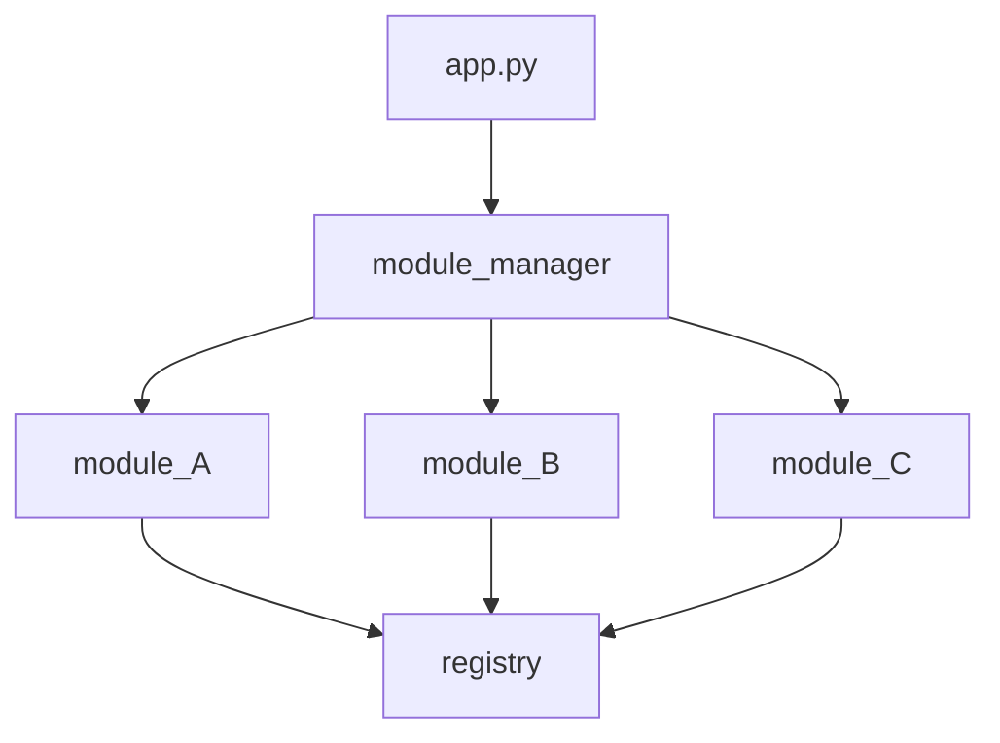

# EZini Module Manager
An **event-driven** way to decouple your imports and function calls.  

Simple, modular, powerful, and easily configurable.  

This is one of those documents you can finish reading with your coffee and understand everything about it.


This ```module_manager``` is pretty basic to use. It sits between the main application module(app.py, \_\_init\_\_.py,  etc) and the rest of the programs' modules. The ```registry``` component of this ```module_manager``` sits seemingly isolated at the end, however, it is in my opinion the most powerful feature of this extremely basic system. 

If you have the same name function in multiple modules that you use with this, it will run into issues. As it sits, it uses one dictionary to store functions. That means if there are 2 functions that do different things, in different modules, with the same names, the second one would overwrite the first one. That's how duplicate key entries work, and that's how this one dictionary system works. Anyone is welcome to fork this. I'll do it myself in a few weeks, I just needed to launch this for a portfolio project.

I'll let it be known that this is my first uploaded package. This ```module_manager``` is highly inspired by a system I built inside Unreal Engine 5 for registering backend factory components. This system works in the same way as that Unreal Engine system; there's a main ```registry``` module that holds references to all shared function objects. When a function lives in ```module_A``` and you call it from ```module_B```, it's as easy as calling the exact function name that lives in ```module_A```. This is the 'magic' of it. ```module_A``` and ```module_B``` don't know about eachother but can call eachothers functions. You can also pass variables. Sweet.

To get a mental model before we start, it looks/works like this:




## Module Manager

>**The ```module_manager``` is initialized by your main application ( app.py, \_\_init\_\_.py, etc ). Basically wherever your apps main entry point is.**

Let's say I have 3 modules I want to import functions from: module_A.py, module_B.py, and module_C.py. Those module names get input into the ```modlist```, in quotes, without the extension(.py), and passed into the ```import_modlist()``` function as a **list**.


There are 2 ways to gain access to the ```import_modlist()``` function:

```python
# app.py

from module_manager import import_modlist
...

...
modlist = ['module_A', 'module_B', 'module_C']
import_modlist(modlist)
```
or
 ```python
# app.py

import module_manager
...

...
modlist = ['module_A', 'module_B', 'module_C']
module_manager.import_modlist(modlist)
 ```
You could even just skip the modlist assignment altogether:
```python
# app.py

import module_manager
...

...
module_manager.import_modlist(['module_A', 'module_B', 'module_C'])
```

You might notice how these module names align with the diagram above. That's because that's exactly what's happening here. 
```import_modlist()``` is injecting your list of modules into the module_manager, so it can import your modules one at a time
in an event-driven manner. We aren't done yet though. There isn't much left. Next is the fun part, assigning functions to variables.


## Adding Your Modules

Now that the ```module_manager``` has the names of your modules, we need to register the functions from those modules with the ```registry``` so they actually get shared. It's easier than it sounds.

For each module that we want to extract functions from, we need to explicitly import the ```registry``` into that module. These are the modules we added above, (A, B, and C) to the ```module manager```. We also need to call a carefully curated function from the 
registry to now register these functions called:
```
register_func(**kwargs)
```

To do this, we can follow this example:

```python
# module_A.py

from registry import register_func, call_func

def test_01() --> None:
    print('Hello, world.')

def test_02() --> None:
    print('Goodbye, world.')

```


## The Registry

Text here


