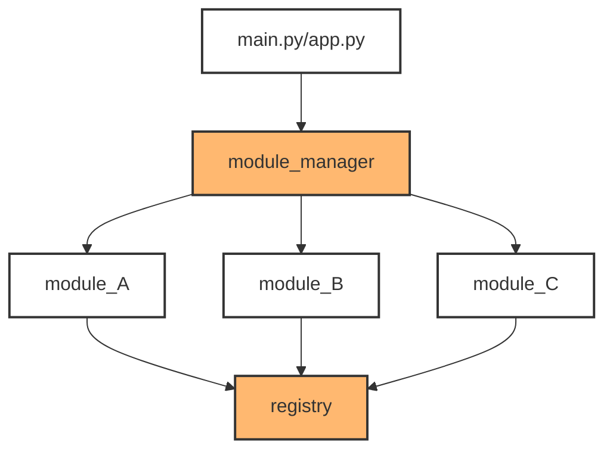

# EZ Module Manager

```python
#PyPI
python3 -m pip install ezmodulemanager
```
[Visit the PyPi repository](https://pypi.org/project/ezmodulemanager/)  

[View the 'Quick Start' guide](#quick-start-gated-execution)

---

An **_event-driven_** way to decouple your imports and function calls.  

Simple, modular, and powerful. Truly Plug-n-Play.

You can probably finish reading this with your coffee and understand 
everything about it.


This `Module Manager` is pretty basic to use. It sits between the main 
application entry point(main.py, app.py, etc) and the rest of the 
program's modules. The `registry` component of this `Module Manager` 
sits seemingly isolated at the end, however, it is in my opinion the 
most powerful feature of this extremely basic system. This system is as 
bare bones as it gets; zero bloat. No additional imports are needed 
other than the basic imports explained in this documentation. Other than 
the awesome functionality you get from this package, you wont even 
notice it in your way.


I'll let it be known that this is my first package. This `Module Manager` 
is highly inspired by a system I built inside Unreal Engine 5 for 
registering backend factory components. This system works in the same 
way as that Unreal Engine system. There's a main `registry` component that 
holds references to all shared objects. In python, that's everything. When 
an object lives in `module_A.py`, you can call it from `module_B.py` and 
neither modules know about one another, thus eliminating circular 
dependencies, while maintaining complete control over your codebase.

To get a mental model before we start, it looks/works like this :


---  
# Quick Start (Gated Execution):

### main.py
```python
# main.py
from ezmodulemanager.module_manager import import_modlist
from ezmodulemanager.registry import get_obj

import_modlist(['module_B', 'module_A'])

# Once the above modules get imported, THEN we run `main()` in 
# `module_B` like so. 
# Modules loaded, now we execute our program.
get_obj('module_B', 'main')()
# Output: Stored offering: shrubbery
```
This is the same as:
```python
main = get_obj('module_B', 'main')
main()
```
---
### module_A.py
```python
# module_A.py
# Need to import these two functions
from ezmodulemanager.registry import get_obj, register_obj, mmreg

@mmreg
class KnightsOfNi():
    def __init__(self, requirement):
        self.requirement = requirement
        self.offering = None
    
    def give_offering(self, offering):
        self.offering = offering
        
        if offering == self.requirement:
            print(f"Accepted: {offering}") 
            return self
        print(f"Rejected: {offering}")    
        return self


# Construct and register a specific instance
knight = KnightsOfNi('shrubbery').give_offering('shrubbery')
# Output: Accepted: shrubbery
register_obj(knight, 'knight_of_ni', __file__)
```
---
### module_B.py
```python
# module_B.py
from ezmodulemanager.registry import get_obj, mmreg

@mmreg
def main():
    # Access the instance created in Module A without a top-level import
    print(f"Stored offering: {get_obj('module_A', 'knight_of_ni').offering}")

# `main()` will only get called if this module is run as the
# top level executable(ie: in command line), OR
# if we explicitly call it.
if __name__=='__main__':
    main()
```
With gating being shown in its most simplest form, that is really how all of this comes together. It's about flow. And this structure(gating) allows you to load any modules in any order without dependency issues, while calling any of your objects anywhere, all because none of your modules know about eachother.

---
# Extended Guide (No gating, just syntax)

## 1. Registering Modules

> [!IMPORTANT]
> The `Module Manager` is initialized by your main application 
> (main.py, app.py, etc) using the `import_modlist()` function. 
> Basically wherever your apps main entry point is.


For a quick technical overview, the `module_manager` passes the module 
names into 
[**import_module()**](https://docs.python.org/3/library/importlib.html#importlib.import_module) 
from the [**importlib**](https://docs.python.org/3/library/importlib.html) 
built-in library.
[**import_module()**](https://docs.python.org/3/library/importlib.html#importlib.import_module) 
loads each module sequentially so every function gets *'registered'* 
before they ever have a chance of being executed.

Any shared module in your application gets added to the `modlist`, in 
quotes, without the `.py` suffix and passed into 
[import_modlist()](#import_modlist) as a *list*. I will show you exactly how 
to do this. 

There are 2 ways to gain access to [import_modlist()](#import_modlist), of 
which are syntactically different ways of importing packages and 
functions in python. There are slight pros and cons to both import 
methods, and you will be shown both methods. Information about pros/cons
can be found under 
[**Modules**](https://docs.python.org/3/tutorial/modules.html#modules) 
in the python docs.

#### Method 1 - Import the `module_manager` module :
 ```python
# main.py / app.py / etc

from ezmodulemanager import module_manager

...

...
# Initialize a list of module names without `.py, etc..` suffix.
modlist = ['module_A', 'module_B', 'module_C', 'module_D']
 
# Pass module names to the `module_manager`.
module_manager.import_modlist(modlist)
 ```
#### Method 2 - Import [import_modlist()](#import_modlist) explicitly :
```python
# main.py / app.py / etc

from ezmodulemanager.module_manager import import_modlist

...

...

modlist = ['module_A', 'module_B', 'module_C', 'module_D']

import_modlist(modlist)
```
#### Preferred Method - Skip the modlist assignment altogether :
```python
# main.py / app.py / etc

from ezmodulemanager import module_manager
...

...

# Skip variable assignment and add your list as a direct argument.
module_manager.import_modlist([
    'module_A',
    'module_B',
    'module_C',
    'module_D'
])
```
> [!IMPORTANT]
> The specific import order in this tutorial is deliberate because we 
> are not using `if __name__ == '__main__':` to gate the execution. As a 
> general rule, avoid designing modules that automatically run all their 
> functions on import. Instead, encapsulate primary logic within a 
> function (e.g., def main():) for controlled, event-driven execution. 
> Note that this specific structure will not compensate for poor design 
> elsewhere; a foundational understanding of Python imports is still 
> required for a clean project even while using this registry framework.


You might notice how these module names align with the diagram above. 
That's because that's exactly what's happening here. 
[import_modlist()](#import_modlist) is injecting your list of modules 
into the `module_manager`, so it can import your modules one at a time 
in an event-driven manner. This is why gating is so important. Once
`import_modlist()` is called **and has completed execution**, THATS when 
you want to actually call your functions. Not while the modules are 
in the middle of being imported. 

---

### Django, Flask, FastAPI, etc...
There isn't anything tricky here, as this framework does not attach 
itself to any other part of your project. It's completely standalone.
Just make sure that you call [import_modlist()](#import_modlist) before 
your routes fire up. It needs to be initialized before your app actually 
starts functioning. Otherwise, functions get called, functions aren't 
registered, no keys, no values, no fun.
```python
# main.py

# module imports

# import_modlist(modlist)

# routes
```

---
## 2. Registering Objects

Now that the `module_manager` has the names of your modules 
via [import_modlist()](#import_modlist), you can register some objects
from `module_A` with the `registry` component using the custom decorator 
[@mmreg](#mmregobj).

You can register and use all types of objects: **classes**, **methods**, 
**functions**, **variables**. I will show you how to use them all.

Back to the example of object registration. This is what `module_A` 
would look like:

```python
# module_A.py

# Import registration decorator.
from ezmodulemanager.registry import mmreg

# The decorator `@mmreg` gets used with any class, method, or function
# to register with the `registry`.
@mmreg
class KnightsOfNi():
    def __init__(self, requirement):
        self.requirement = requirement
        self.offering = None

    def give_offering(self, offering):
        if offering == self.requirement:
            self.offering = offering
            print(f'Your {offering} is accepted as an offering..')
            return self
        print(f'Your {offering} is not accepted as an offering..')
        self.offering = offering
        return self

    @staticmethod
    @mmreg
    def gloat():
        print('Ni! Ni! Ni! Ni!')

@mmreg
def lancelot(offering, recipient) -> None:
    print(f'I am Sir Lancelot! This {offering} is my offering')
    recipient.give_offering('shrubbery')
    return None

@mmreg
def king_arthur():
    print('I am King Arthur!')
```

You will see how to manipulate these objects in the next section, 
[Getting Objects](#3-getting-objects).  


---
## 3. Getting Objects
```python
from ezmodulemanager.registry import get_obj

get_obj(
    module_name: str,
    obj_name: str,
    *args: Any
) -> Any:
```
This is where the versatility comes into play. You have complete access 
to these objects while zero circular dependencies occur. I will 
show you multiple ways to use this functionality.

For the sake of an easy Tutorial, we can now use `module_B` to gain access 
to all objects we just registered in `module_A`: **`KnightsOfNi()`**, 
**`lancelot()`**, and **`king_arthur()`**.

> [!IMPORTANT]
> This `registry` component takes advantage of nested dictionaries. 
> Therefore [get_obj()](#get-object), takes 2 main positional arguments: 
> the containing modules namespace, and the function name itself. 
> Pretty basic.


### Parameterless Functions:

```python
# module_B.py

# Get parameterless function from `registry`; store away.
king_arthur = get_obj('module_A', 'king_arthur')
# Call the function.
king_arthur()
# Result
> I am King Arthur!
```
is the same as:
```python
# module_B.py

# Call parameterless function from `registry`; don't store.
get_obj('module_A', 'king_arthur')()
# Result
> I am King Arthur!
```


### Parameterized Functions:
```python
# module_B.py

# Get parameterized function from `registry`; store away.
lancelot = get_obj('module_A', 'lancelot')
# Call the function.
lancelot('shrubbery')
# Result
> I am Sir Lancelot! This shrubbery is my offering.
```
is the same as:
```python
# module_B.py

# Call parameterized function from `registry`; don't store.
get_obj('module_A', 'lancelot')('shrubbery')
# Result
> I am Sir Lancelot! This shrubbery is my offering.
```


### Classes: 


```python
(Not Recommended Approach)
# module_B.py 

# Get the class object reference.
knight_of_ni_obj = get_obj('module_A', 'KnightsOfNi')
# Construct a class instance object.
knight_of_ni = knight_of_ni_obj('shrubbery')
```
or...  

```python
(Recommended Approach)
# module_B.py 

# Use the class constructor to get a class instance 
# object in one go. Store the class instance object as `knight_of_ni`.
knight_of_ni = get_obj('module_A', 'KnightsOfNi')('shrubbery')
```
now...
```python
...continued from above
# module.B.py

# Check __init__ for the data attribute 
# `requirement`, of our newly constructed class 
# instance object. Lets see what this `knight_of_ni` 
# wants, even though we already know..
print(knight_of_ni.requirement)
# Result
> shrubbery

# Now lazily give an offering to the `night_of_ni` instance using the
# method object before they spaz out or run out of spit.
knight_of_ni.give_offering('brick')
# Result - Ah, gave em the wrong offering.
> Your brick is not accepted as an offering..

# Give them the correct offering this time.
knight_of_ni.give_offering('shrubbery')
# Result
> Your shrubbery is accepted as an offering..
```

Hopefully this shows you the power of this system so far.  Next up, 
storing these instances with variables to then be maniuplated inside 
other modules.


### Register Variables with `register_obj()`:
(constants, globals, whatever you want....thats the point)

```python
# module_B.py

# Import a new function `register_obj()`.
from ezmodulemanager.registry import get_obj, register_obj

# Instantiate class instance object.
knight_of_ni = get_obj('module_A', 'KnightsOfNi')('shrubbery')
# Give the `knight_of_ni` a brick as an offering.
knight_of_ni.give_offering('brick')
# Result
> Your brick is not accepted as an offering..

# 'Register' the class instance object with the `registry`
# component. It's a little bit more work.
register_obj(knight_of_ni, 'knight_of_ni', __file__)
    """
    It works by passing in 3 arguments: 
        
        - First arg, the reference to the object itself. 
        - Second arg, the str literal to register the
            object as. This simply defines the `dict` key.
        - Third arg, will always be `__file__`. This
            tells the `registry` what namespace to
            register the object within.
    """
```
Then, if we wanted to access this class instance from another module, 
say `module_C`, we can.

```python
# module_C.py

from ezmodulemanager.registry import get_obj

# Store the reference using `get_obj()`.
# This is all the same as above. args: module name, object name.
# str literals.
knight_of_ni_instance = get_obj('module_B', 'knight_of_ni')

# Use it like normal
# Since you gave a 'brick' as an offering to this specific
# class instance object in `module_B`, retrieve 
# that value here, in `module_C`.
offering = knight_of_ni_instance.offering
print(offering)

# Result
> brick
```
You could also use `knight_of_ni_instance.give_offering('shrubbery')` in
`module_C` to actually manipulate that class instance object, like 
before.


I think that pretty much wraps up classes. At least I think it gives you 
enough to understand what you have access to. Its all pretty much just 
normal python syntax, how data works.. Anyways, I did want to move you 
onto storing methods, which is just more usual syntax. Even as far as 
showing an example of a 
[@staticmethod](https://docs.python.org/3/library/functions.html#staticmethod) 
which shows the gist of how this works in its basic form.


### Methods

The following examples are going to be done within
`module_C` and `module_D`. Its just to show that you can literally do 
this from anywhere, with the class object being in `module_A`. 
Here are some examples:

```python
# module_C.py
from ezmodulemanager.registry import get_obj, register_obj

# Instantiate class instance.
knight_of_ni = get_obj('module_A', 'KnightsOfNi')('shrubbery')
# Register not the class instance, but the method object `give_offering` instead.
# Remember, the dunder `__file__` is the required 3rd argument, always.
register_obj(knight_of_ni.give_offering, 'give_offering', __file__)
```

You have now successfully instantiated a `Class instance object` here in 
`module_C`, from a `Class object` that is scoped in `module_A`
([Registering Objects](#2-registering-objects)). You have also 
'registered' the `give_offering` method object with the `registry` 
component. Let's move onto a new module, `module_D`, and call that 
method we just 'registered'. We can do this 2 ways.  


#### Store the method object then call:

```python
# module_D.py
from ezmodulemanager.registry import get_obj

# Retreive the method object from `module_C`.
give_offering = get_obj('module_c', 'give_offering')
# Call method object with required args.
give_offering('brick')
# Result
> Your brick is not accepted as an offering..
```

#### Call the method object directly:

```python
# module_D.py
from ezmodulemanager.registry import get_obj

# Retreive the method object from `module_C` and call it with required args.
get_obj('module_c', 'give_offering')('shrubbery')
# Result
> Your shrubbery is accepted as an offering..
```

We can also follow the same python principals and syntax to directly access 
[@staticmethods](https://docs.python.org/3/library/functions.html#staticmethod) 
and [@classmethods](https://docs.python.org/3/library/functions.html#classmethod). 
This comes with an understanding that they are used on `Class objects` 
themselves and not the `Class instance object`.

Up above in `module_A`([Registering Objects](#2-registering-objects)), 
we 'registered' a method called `gloat` using the custom decorator, 
`mmreg`.  In `module_C` or `module_D` or literally anywhere, we can 
follow this example to call this static method object.

```python
# module_anything.py
from ezmodulemanager.registry import get_obj

# Retreive the static method object from `module_A`.
# Following above example, lets just call this one directly.
get_obj('module_A', 'gloat')()
# Result
> Ni! Ni! Ni! Ni!
```

This should show you most of what you can do with this lightweight 
framework. It's so generalized that it's tough to display every little 
thing. It uses generalized python concepts and syntax. It's just a flow 
control device if anything. Anyways, theres an API reference below.  


---
## API Reference

### import_modlist(modlist)
```python
def import_modlist(modlist: Sequence[str]) -> None:
    """Import modules sequentially.

    :param modlist: A tuple of module names to register with the
        :attr:`_REGISTRY`. Each module name is entered as an 
        argument omitting the `.py` suffix.
        This includes two types of modules:

        - Modules that want to store functions with :attr:`_REGISTRY`.
        - Modules that want to use functions stored with :attr:`_REGISTRY`.

    :raises MissingModuleError: If a module in `modlist` cannot be found.
    """
```
---
### @mmreg 
Registration decorator for classes, methods and functions
```python
def mmreg(obj: Any)-> Callable[..., Any]:
    """Store an object in the `_Registry` as a decorator.
    
    `@mmreg` automatically stores the containing modules namespace
    as a key for the outermost `dict`. It then stores the object name as
    a key for the innermost `dict`. Last but not least, it stores the 
    reference of the object as the value for that 
    innermost `dict`. You can then use that reference to 
    call on that object.

    :param obj: The object to store in the `_REGISTRY`.

    :raises: FunctionRegistrationError: Raised if `register_obj()' is
        NOT passing a valid object. Usually when an object 
        registration attempt is done using a str literal.
    """
```
---
### register_obj(obj, obj_name, mod_path)
Registration for Variables
```python
def register_obj(obj: Any, obj_name: str, mod_path: str) -> None:
    """Stores a variable-type object in the `_REGISTRY`.
            
    `register_obj()` does the same exact thing as `mmreg()`, 
    except this allows the control over manual 'registration'
    from a modular standpoint.

    :param obj: The object itself to store in the `_REGISTRY`.
    :param obj_name: The str literal to name the object you are 
        'registering'. This acts as the key lookup in the `dict`.
    :param mod_path: This argument will always be `__file__`. 
        This attribute is only avaialble from the module its 
        called from.

    :raises: FunctionRegistrationError: Raised if `register_obj()' is
        NOT passing a valid object. Usually when an object 
        registration attempt is done using a str literal.
    """
```
---
### get_obj(module_name, obj_name, *args)
```python
def get_obj(
    module_name: str,
    obj_name: str,
    *args: Any
) -> Any:
    """Retrieves an object that has been stored in the `_REGISTRY`.

    :param module_name: The module namespace whose object you 
        want access to. 
    :param obj_name: The name of the object within the `module_name`
        to access.
    :param *args: Variable positional arguments passed to the registered 
        object. If provided, the object is executed immediately.
    
    :returns: If no arguments are provided, it returns a reference 
        to the object itself.
    :returns: If arguments are provided, it executes the object immediately,
        and returns `Any` return value from the executed object.

    :raises: RegistryKeyError: Raised if `module_name` or `obj_name` does 
        not exist in the `registry` component.
    """
```
---
### query_registry()
```python
def query_registry()-> Mapping[str, Mapping[str, Any]]:
    """Query the `_REGISTRY` global for entries.

    :returns: Returns a raw query of nested dictionaries. 
        Each module has its own `dict`(like a module global __dict__) 
        which contains all objects within its own namespace that are
        registered with the `registry` component.    
    """
```
---